# Architecture Atlas — Diagram Previews

Editable source files are in `diagrams/mermaid/`. Mermaid blocks below display natively on GitHub.

## 01 — AI Landscape

Conceptual taxonomy: model architectures, learning paradigms, and systems overlap; this is not a strict inheritance tree.

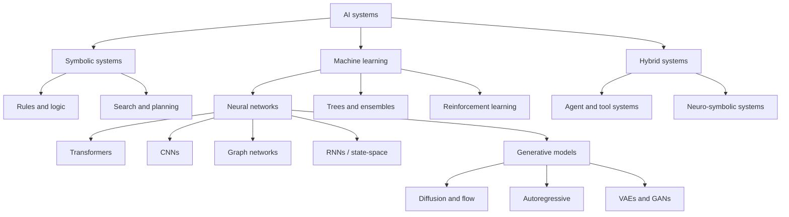
```mermaid
flowchart TD
    AI["AI systems"] --> SYM["Symbolic systems"]
    AI --> ML["Machine learning"]
    AI --> HYB["Hybrid systems"]
    SYM --> RULE["Rules and logic"]
    SYM --> PLAN["Search and planning"]
    ML --> NN["Neural networks"]
    ML --> TREE["Trees and ensembles"]
    ML --> RL["Reinforcement learning"]
    NN --> TRANS["Transformers"]
    NN --> CNN["CNNs"]
    NN --> GNN["Graph networks"]
    NN --> REC["RNNs / state-space"]
    NN --> GEN["Generative models"]
    GEN --> DIFF["Diffusion and flow"]
    GEN --> AR["Autoregressive"]
    GEN --> VAE["VAEs and GANs"]
    HYB --> AGENT["Agent and tool systems"]
    HYB --> NS["Neuro-symbolic systems"]
```

## 02 — Generic AI System

Optional state and memory are external modules, not automatically updated neural weights.

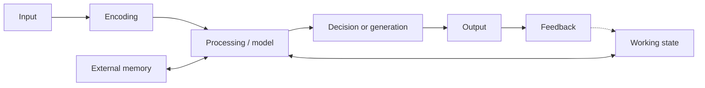
```mermaid
flowchart LR
    IN["Input"] --> EN["Encoding"]
    EN --> CORE["Processing / model"]
    CORE --> DEC["Decision or generation"]
    DEC --> OUT["Output"]
    MEMORY["External memory"] <--> CORE
    STATE["Working state"] <--> CORE
    OUT --> FEED["Feedback"]
    FEED -.-> STATE
```

## 03 — Training vs Inference

Training and inference are distinct workflows; many inference deployments never update weights.

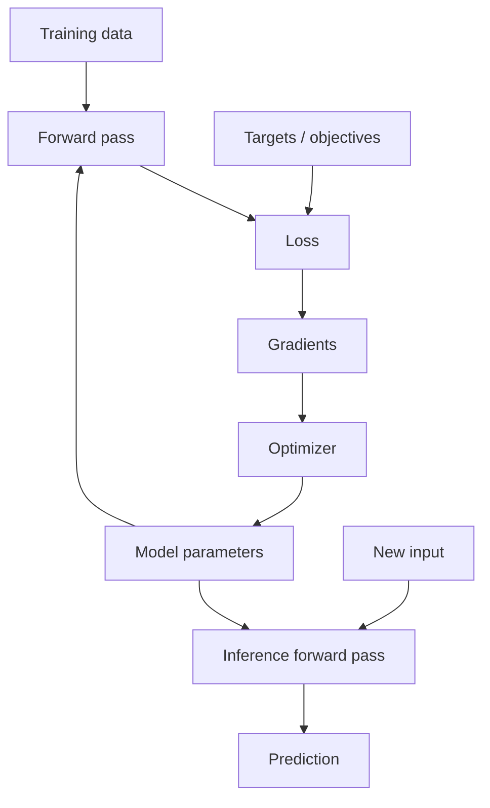
```mermaid
flowchart TD
    DATA["Training data"] --> FOR["Forward pass"]
    WEIGHTS["Model parameters"] --> FOR
    FOR --> LOSS["Loss"]
    TARGET["Targets / objectives"] --> LOSS
    LOSS --> GRAD["Gradients"]
    GRAD --> OPT["Optimizer"]
    OPT --> WEIGHTS
    WEIGHTS --> INF["Inference forward pass"]
    QUERY["New input"] --> INF
    INF --> PRED["Prediction"]
```

## 04 — Transformer Internals

Illustrative single-block attention; practical Transformers use multihead variants, multiple blocks, normalization details, and task-specific heads.

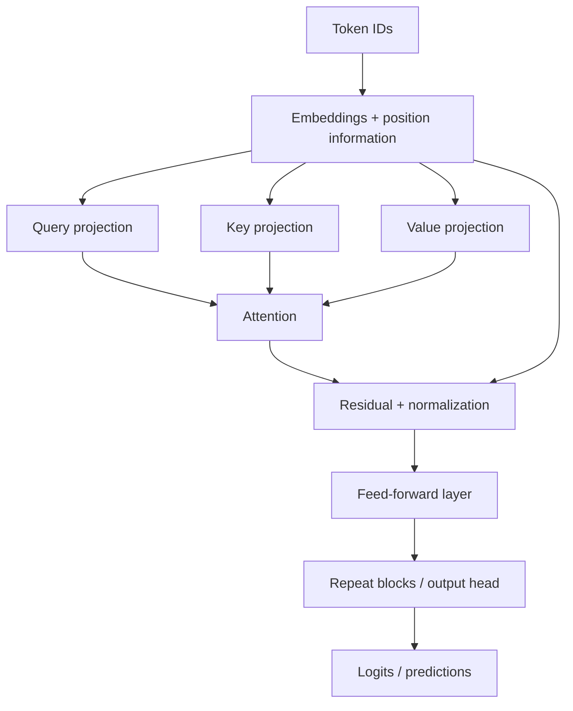
```mermaid
flowchart TD
    TOK["Token IDs"] --> EMB["Embeddings + position information"]
    EMB --> Q["Query projection"]
    EMB --> K["Key projection"]
    EMB --> V["Value projection"]
    Q --> ATT["Attention"]
    K --> ATT
    V --> ATT
    ATT --> RES["Residual + normalization"]
    EMB --> RES
    RES --> FF["Feed-forward layer"]
    FF --> NEXT["Repeat blocks / output head"]
    NEXT --> LOG["Logits / predictions"]
```

## 05 — Diffusion Training and Sampling

Simplified denoising diffusion; flow-matching variants can use different training targets and sampling rules.

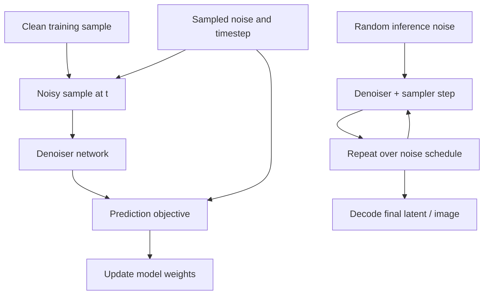
```mermaid
flowchart TD
    IMG["Clean training sample"] --> NOISE["Noisy sample at t"]
    EPS["Sampled noise and timestep"] --> NOISE
    NOISE --> DENOISE["Denoiser network"]
    DENOISE --> LOSS["Prediction objective"]
    EPS --> LOSS
    LOSS --> UPDATE["Update model weights"]
    START["Random inference noise"] --> SAMPLE["Denoiser + sampler step"]
    SAMPLE --> LOOP["Repeat over noise schedule"]
    LOOP --> SAMPLE
    LOOP --> DEC["Decode final latent / image"]
```

## 06 — Decision and Reinforcement Learning

Policy is pluggable: deterministic rules, utility scores, supervised action model, or RL policy.

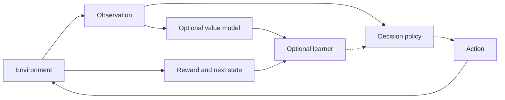
```mermaid
flowchart LR
    ENV["Environment"] --> OBS["Observation"]
    OBS --> POLICY["Decision policy"]
    POLICY --> ACTION["Action"]
    ACTION --> ENV
    ENV --> REWARD["Reward and next state"]
    REWARD --> LEARN["Optional learner"]
    LEARN -.-> POLICY
    OBS --> VALUE["Optional value model"]
    VALUE --> LEARN
```

## 07 — Graph Neural Network

Graph message passing is one possible graph-network design.

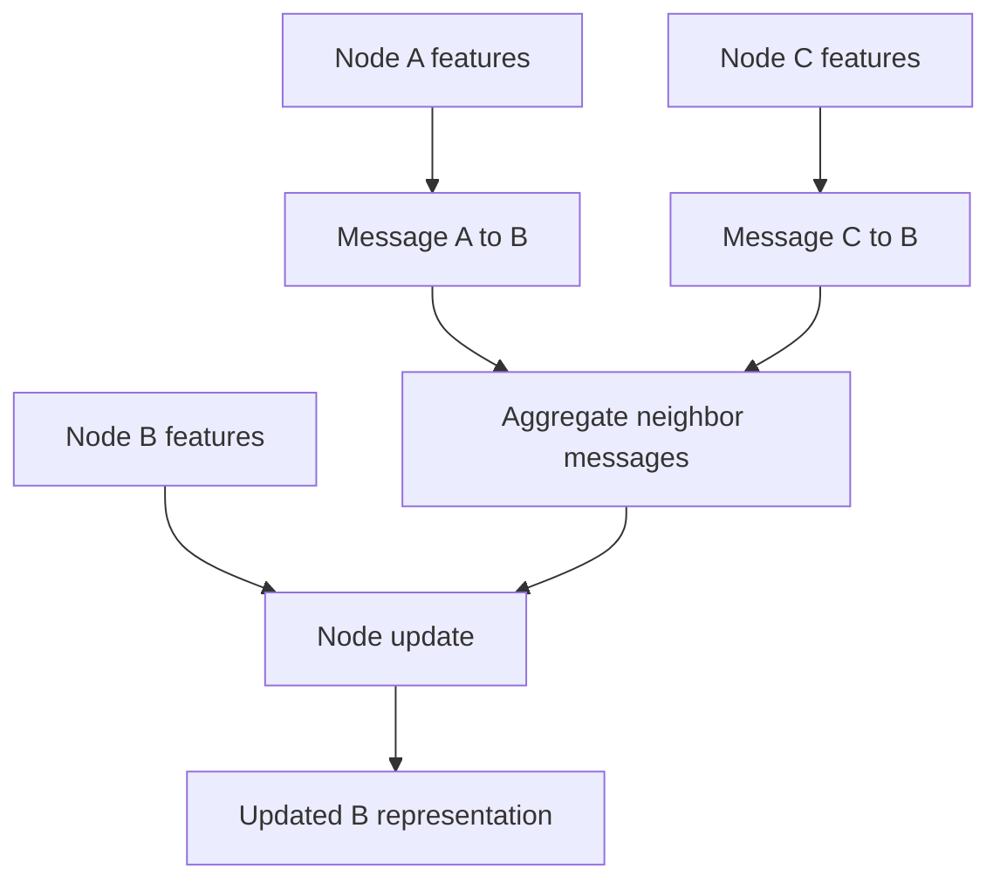
```mermaid
flowchart TD
    A["Node A features"] --> AB["Message A to B"]
    C["Node C features"] --> CB["Message C to B"]
    AB --> AGG["Aggregate neighbor messages"]
    CB --> AGG
    B["Node B features"] --> UPD["Node update"]
    AGG --> UPD
    UPD --> NEW["Updated B representation"]
```

## 08 — Recurrent / State-space Model

Recurrent/state-space models differ internally; a state update is the shared conceptual motif.

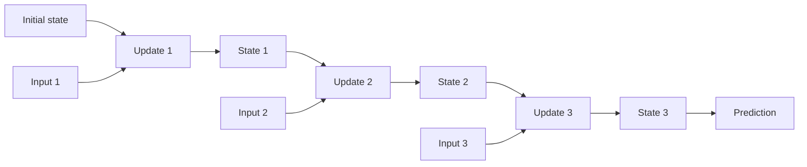
```mermaid
flowchart LR
    S0["Initial state"] --> U1["Update 1"]
    X1["Input 1"] --> U1
    U1 --> S1["State 1"]
    S1 --> U2["Update 2"]
    X2["Input 2"] --> U2
    U2 --> S2["State 2"]
    S2 --> U3["Update 3"]
    X3["Input 3"] --> U3
    U3 --> S3["State 3"]
    S3 --> OUT["Prediction"]
```

## 09 — Representations and Tensors

Tensor shapes must have semantic definitions; matching numeric dimensions alone is insufficient.

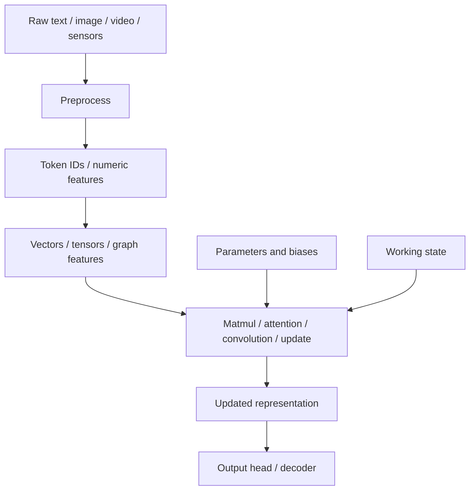
```mermaid
flowchart TD
    RAW["Raw text / image / video / sensors"] --> PRE["Preprocess"]
    PRE --> IDS["Token IDs / numeric features"]
    IDS --> REP["Vectors / tensors / graph features"]
    REP --> OPS["Matmul / attention / convolution / update"]
    W["Parameters and biases"] --> OPS
    ST["Working state"] --> OPS
    OPS --> RES["Updated representation"]
    RES --> OUT["Output head / decoder"]
```

## 10 — Single Artificial Neuron

Numerical example: z = (0.5×0.8)+(-1×-0.2)+0.1 = 0.7; sigmoid(z) ≈ 0.668.

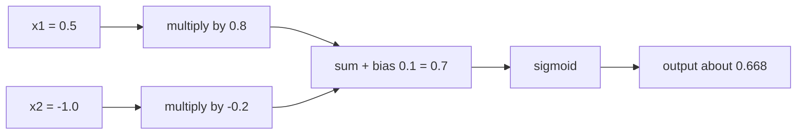
```mermaid
flowchart LR
    X1["x1 = 0.5"] --> M1["multiply by 0.8"]
    X2["x2 = -1.0"] --> M2["multiply by -0.2"]
    M1 --> SUM["sum + bias 0.1 = 0.7"]
    M2 --> SUM
    SUM --> SIG["sigmoid"]
    SIG --> Y["output about 0.668"]
```

## 11 — Gradient Learning Loop

Applies to differentiable learning; symbolic search and tree algorithms do not necessarily use backpropagation.

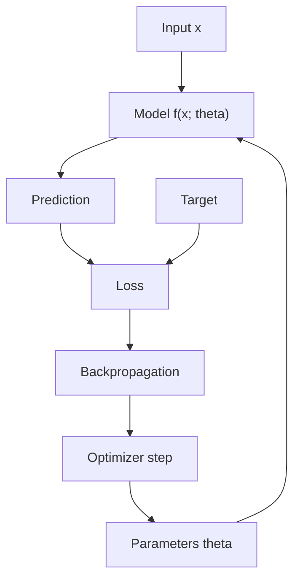
```mermaid
flowchart TD
    X["Input x"] --> F["Model f(x; theta)"]
    TH["Parameters theta"] --> F
    F --> YH["Prediction"]
    YH --> LOSS["Loss"]
    TARGET["Target"] --> LOSS
    LOSS --> BACK["Backpropagation"]
    BACK --> OPT["Optimizer step"]
    OPT --> TH
```

## 12 — Hardware Execution

The data paths are representative; hardware and runtime differ by backend.

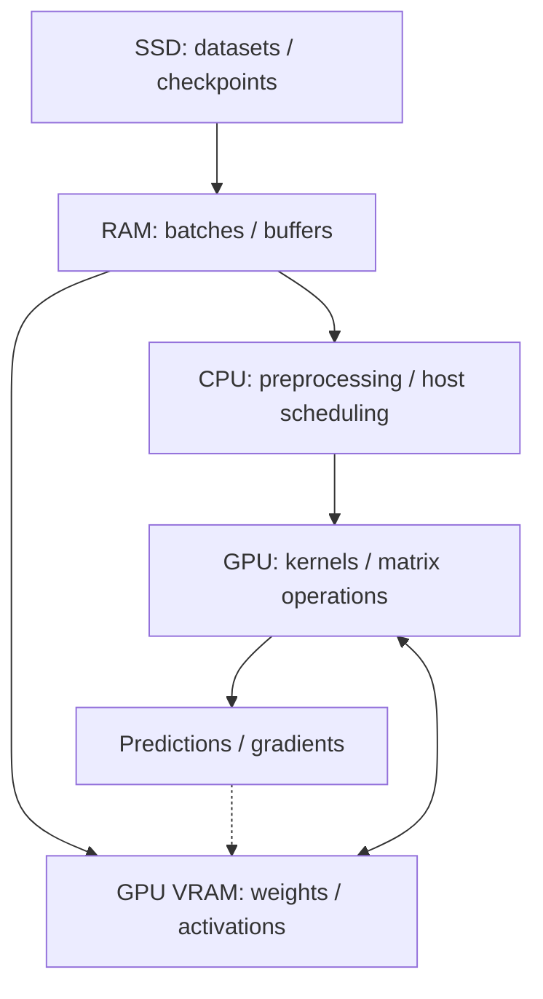
```mermaid
flowchart TD
    SSD["SSD: datasets / checkpoints"] --> RAM["RAM: batches / buffers"]
    RAM --> CPU["CPU: preprocessing / host scheduling"]
    RAM --> VRAM["GPU VRAM: weights / activations"]
    CPU --> GPU["GPU: kernels / matrix operations"]
    VRAM <--> GPU
    GPU --> OUTPUT["Predictions / gradients"]
    OUTPUT -.-> VRAM
```

## 13 — Illustrative Hybrid AI

Research concept only, not proof of general intelligence or subjective experience.

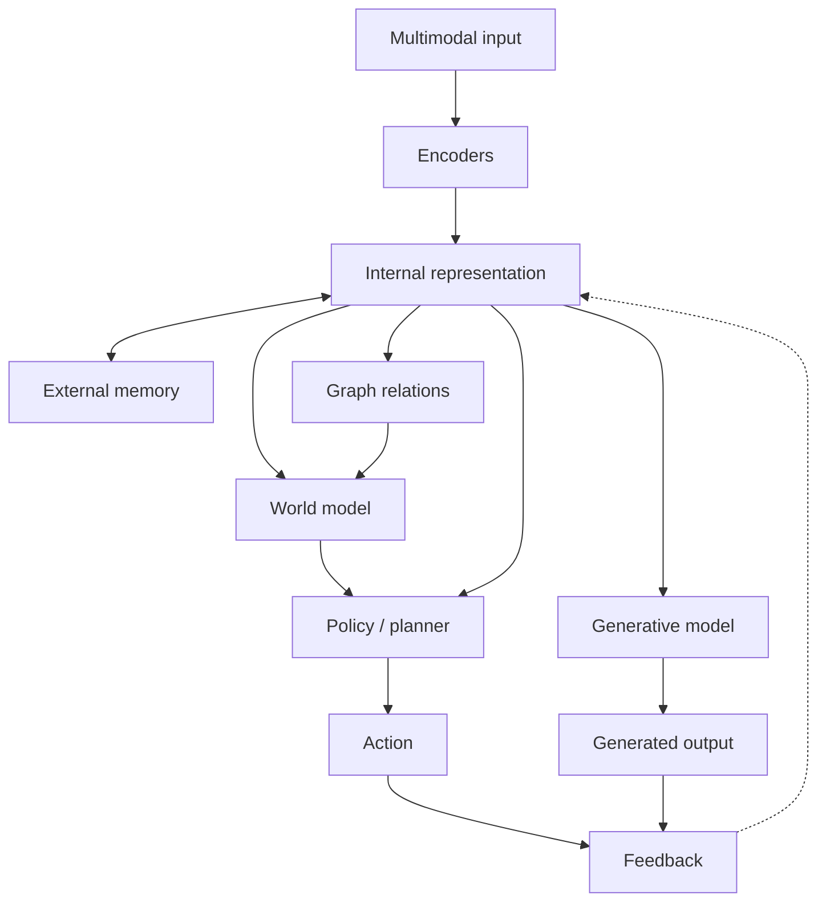
```mermaid
flowchart TD
    INPUT["Multimodal input"] --> ENC["Encoders"]
    ENC --> STATE["Internal representation"]
    STATE <--> MEM["External memory"]
    STATE --> WORLD["World model"]
    STATE --> GRAPH["Graph relations"]
    GRAPH --> WORLD
    WORLD --> POLICY["Policy / planner"]
    STATE --> POLICY
    STATE --> GEN["Generative model"]
    POLICY --> ACTION["Action"]
    GEN --> OUT["Generated output"]
    ACTION --> FEEDBACK["Feedback"]
    OUT --> FEEDBACK
    FEEDBACK -.-> STATE
```

## 14 — Modular Platform Kernel

Framework boundary: stable registry, validators, orchestration, and lineage; family-specific behavior stays outside.

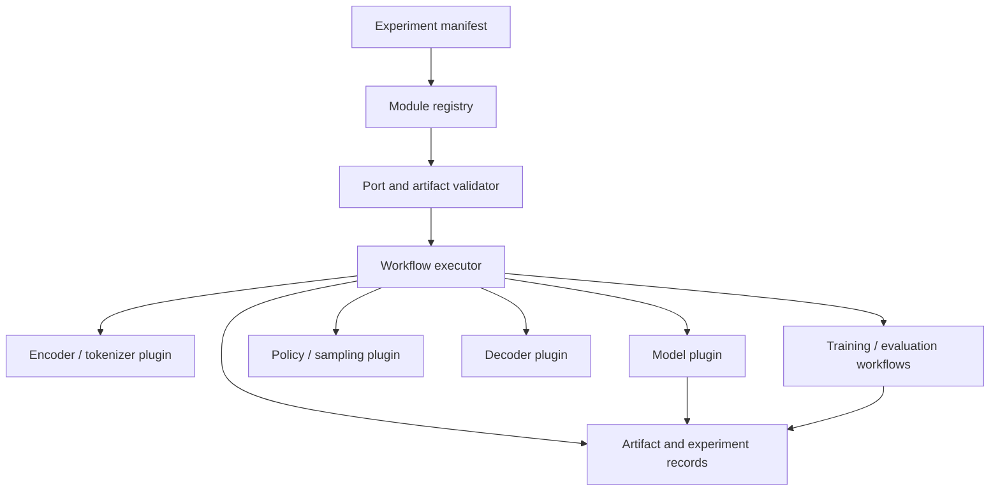
```mermaid
flowchart TD
    SPEC["Experiment manifest"] --> REG["Module registry"]
    REG --> CHECK["Port and artifact validator"]
    CHECK --> EXEC["Workflow executor"]
    EXEC --> ENC["Encoder / tokenizer plugin"]
    EXEC --> MODEL["Model plugin"]
    EXEC --> POLICY["Policy / sampling plugin"]
    EXEC --> DEC["Decoder plugin"]
    EXEC --> TRAIN["Training / evaluation workflows"]
    EXEC --> ART["Artifact and experiment records"]
    MODEL --> ART
    TRAIN --> ART
```

## 15 — Contract-checked Module Swap

Replacement requires matching semantics and checkpoint compatibility, not simply matching function names.

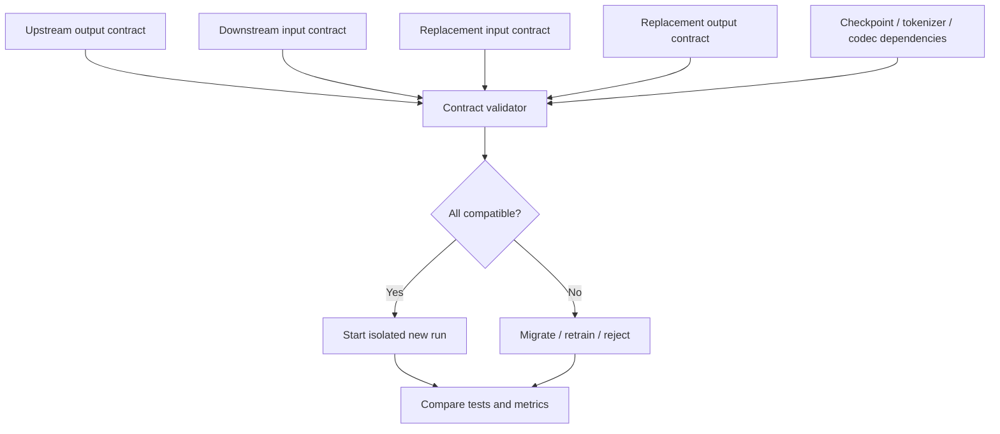
```mermaid
flowchart TD
    UP["Upstream output contract"] --> V["Contract validator"]
    DOWN["Downstream input contract"] --> V
    NEWIN["Replacement input contract"] --> V
    NEWOUT["Replacement output contract"] --> V
    DEP["Checkpoint / tokenizer / codec dependencies"] --> V
    V --> DEC{"All compatible?"}
    DEC -->|Yes| SNAP["Start isolated new run"]
    DEC -->|No| MIG["Migrate / retrain / reject"]
    SNAP --> TEST["Compare tests and metrics"]
    MIG --> TEST
```

## 16 — Training, Evaluation, Deployment

Quantized outputs are versioned derived artifacts and must be separately evaluated.

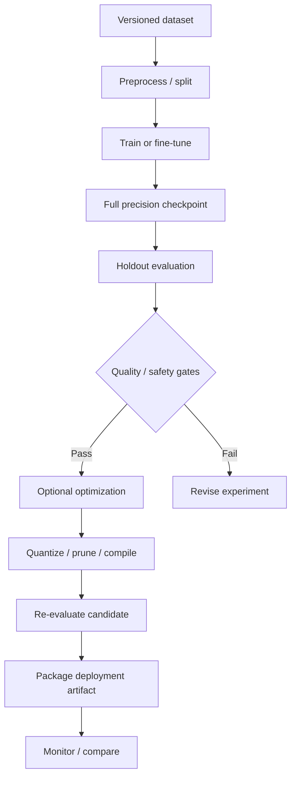
```mermaid
flowchart TD
    DATA["Versioned dataset"] --> PRE["Preprocess / split"]
    PRE --> TRAIN["Train or fine-tune"]
    TRAIN --> CK["Full precision checkpoint"]
    CK --> EVAL["Holdout evaluation"]
    EVAL --> GATE{"Quality / safety gates"}
    GATE -->|Pass| OPT["Optional optimization"]
    GATE -->|Fail| REVISE["Revise experiment"]
    OPT --> QT["Quantize / prune / compile"]
    QT --> REVAL["Re-evaluate candidate"]
    REVAL --> DEP["Package deployment artifact"]
    DEP --> MON["Monitor / compare"]
```

## 17 — Text, Image, and Video Pipelines

A shared runtime can orchestrate distinct family-specific pipelines. Not every family needs the same modules.

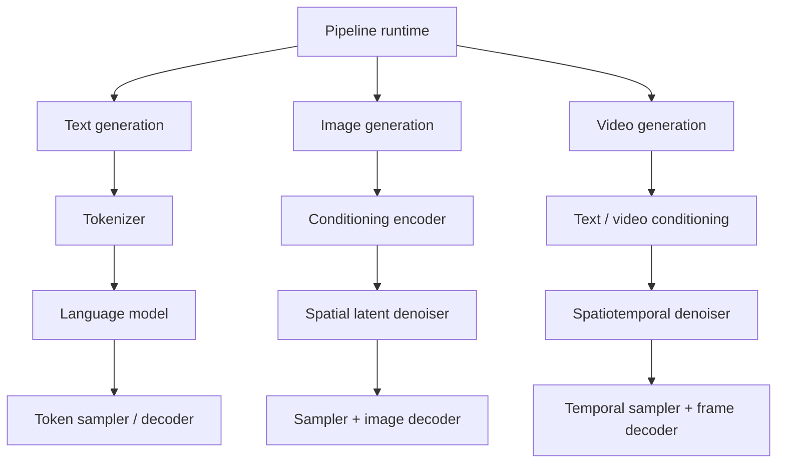
```mermaid
flowchart TD
    ROOT["Pipeline runtime"] --> TEXT["Text generation"]
    ROOT --> IMG["Image generation"]
    ROOT --> VID["Video generation"]
    TEXT --> TOK["Tokenizer"]
    TOK --> LM["Language model"]
    LM --> TS["Token sampler / decoder"]
    IMG --> COND["Conditioning encoder"]
    COND --> ID["Spatial latent denoiser"]
    ID --> IS["Sampler + image decoder"]
    VID --> TCOND["Text / video conditioning"]
    TCOND --> TD["Spatiotemporal denoiser"]
    TD --> TV["Temporal sampler + frame decoder"]
```

## 18 — Experiment Lineage and Compatibility

Record dependencies to reproduce experiments, reject invalid swaps, and roll back.

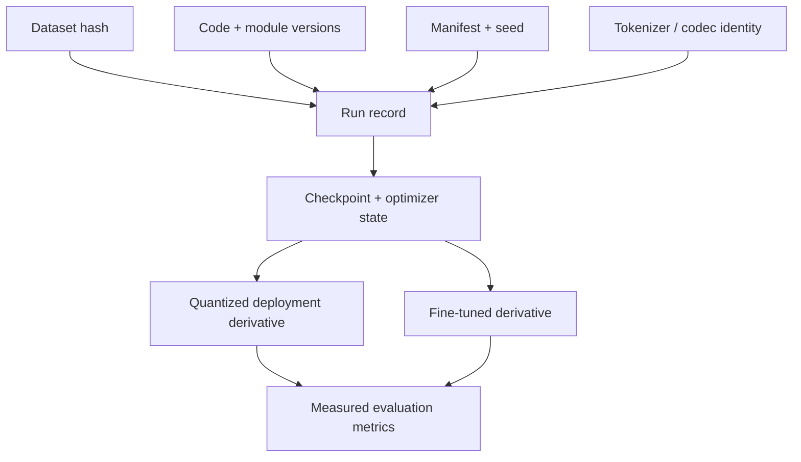
```mermaid
flowchart TD
    DS["Dataset hash"] --> RUN["Run record"]
    CODE["Code + module versions"] --> RUN
    CFG["Manifest + seed"] --> RUN
    TOK["Tokenizer / codec identity"] --> RUN
    RUN --> CK["Checkpoint + optimizer state"]
    CK --> Q["Quantized deployment derivative"]
    CK --> FT["Fine-tuned derivative"]
    Q --> MET["Measured evaluation metrics"]
    FT --> MET
```

## 19 — Runtime State vs Learned Weights

Working state and external memory can change without weight updates.

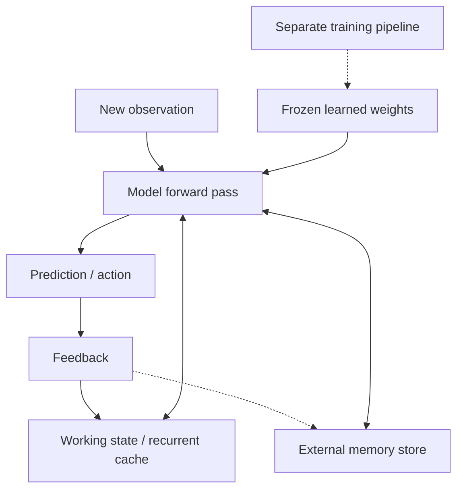
```mermaid
flowchart TD
    INPUT["New observation"] --> MODEL["Model forward pass"]
    WEIGHTS["Frozen learned weights"] --> MODEL
    STATE["Working state / recurrent cache"] <--> MODEL
    MEMORY["External memory store"] <--> MODEL
    MODEL --> OUTPUT["Prediction / action"]
    OUTPUT --> FEEDBACK["Feedback"]
    FEEDBACK --> STATE
    FEEDBACK -.-> MEMORY
    TRAIN["Separate training pipeline"] -.-> WEIGHTS
```

## 20 — Deterministic Decision Baseline

Use a deterministic baseline as the invariant reference when developing neural decisions.

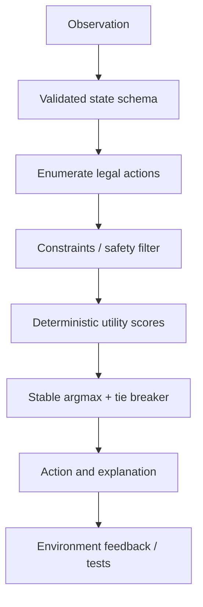
```mermaid
flowchart TD
    OBS["Observation"] --> ADAPT["Validated state schema"]
    ADAPT --> ACT["Enumerate legal actions"]
    ACT --> RULE["Constraints / safety filter"]
    RULE --> SCORE["Deterministic utility scores"]
    SCORE --> SELECT["Stable argmax + tie breaker"]
    SELECT --> OUT["Action and explanation"]
    OUT --> EVAL["Environment feedback / tests"]
```
